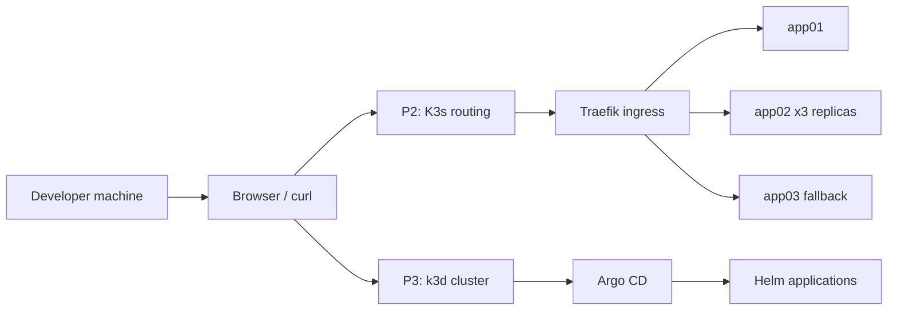

# Project Title

Inception of Things

## Overview

This repository contains the 42-style Inception of Things labs for learning
lightweight Kubernetes, local cluster bootstrap, host-header routing, and GitOps
deployment with Argo CD.

The current workspace is organized around two implemented lab parts:

| Lab | Focus | Main paths |
| --- | --- | --- |
| Part 2 | K3s application routing by HTTP `Host` header. | [p2/](p2/) |
| Part 3 | k3d cluster creation and Argo CD bootstrap. | [p3/](p3/) |

Part 2 deploys three Nginx applications into Kubernetes. Requests for
`app1.local` route to `app01`, requests for `app2.local` route to `app02`, and
unknown hosts fall back to `app03`. Part 3 creates a local k3d cluster, installs
Argo CD, exposes it through localhost, and keeps application definitions under
[p3/k8s/helm/](p3/k8s/helm/).

Useful entrypoints:

- [p2/README.md](p2/README.md) introduces the Part 2 routing exercise.
- [p2/manifests/README.md](p2/manifests/README.md) explains the Kubernetes
  manifests and validation flow.
- [p3/bins/install.sh](p3/bins/install.sh) recreates the local `p3-default`
  k3d cluster.
- [p3/bins/argocd-init.sh](p3/bins/argocd-init.sh) applies, deletes, or prints
  credentials for the Argo CD bootstrap.

## Required Dependencies

Install these tools before running the labs locally:

| Dependency | Used for |
| --- | --- |
| Bash | Running repository scripts in [p3/bins/](p3/bins/). |
| Docker | Running local containers and backing k3d clusters. |
| Docker Compose | Running the Part 2 bastion workflow when using Compose. |
| k3d | Creating the local Kubernetes cluster for Part 3. |
| kubectl | Applying manifests and validating live Kubernetes resources. |
| curl | Testing HTTP routing and Argo CD localhost access. |
| tar | Copying Part 2 manifest directories into the bastion workflow. |

For Part 3, Argo CD is installed from the Kubernetes manifests in
[p3/k8s/argocd/](p3/k8s/argocd/). Access it explicitly with
`http://127.0.0.1/` after bootstrap to avoid browser HTTPS redirects.

## Difficulties Rating

| Area | Rating | Notes |
| --- | --- | --- |
| Kubernetes manifests | 2/5 | The resources are small, but labels, Services, and Ingress rules must match. |
| Host-header routing | 3/5 | Requires understanding Traefik routing and testing with explicit `Host` headers. |
| k3d cluster bootstrap | 3/5 | Local networking, kubeconfig paths, and port exposure can be easy to mix up. |
| Argo CD bootstrap | 4/5 | Requires namespace setup, server HTTP mode, ingress behavior, and credentials handling. |
| Overall project | 3/5 | Manageable with the scripts, but live-cluster validation is essential. |
